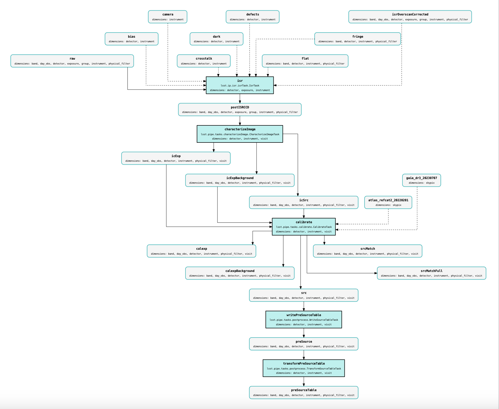

# SVV workflow : analysis_tools, JIRA, tech. notes Tutorial

**Orateurs: Dominique BOUTIGNY (LAPP), Rance Solomon (LAPP), Dr Sylvie Dagoret (IJCLab)** 

## Introduction

## Rubin technical notes

The Rubin-project invite the members involved in the commissioning to write technical notes or it didn't happen.  

The process of writting these notes is explained [here](./technotes/README.md).

## Analysis tools

### Preliminary on software pipelines

The structure of DM software consists in an acyclic sequence of ``Tasks`` using some ``data-products`` at their input and producing output ``data-products``. Even if there is some documentation, for example the full diagram for the [DRP pipeline (Data Release Pipeline)](https://pipelines.lsst.io/) on those pipelines, a synthetic summary on those pipelines may be visualized in diagrams refered as [quantum graphs](https://tigress-web.princeton.edu/~lkelvin/pipelines/).

-  Selecting one of these pipelines from the [following page](https://tigress-web.princeton.edu/%7Elkelvin/pipelines/w_2024_12/):

 

- selecting the [``drp_pipe/LATISS/DRP/pipeline_drp_pipe_LATISS_DRP_step1``](https://tigress-web.princeton.edu/%7Elkelvin/pipelines/w_2024_12/drp_pipe/LATISS/DRP/pipeline_drp_pipe_LATISS_DRP_step1.pdf)

This diagrams shows the sequence of tasks as rectangles (light-blue filled) consuming some data-products at their inputs shown as rounded corners rectangles and producing other data-producted shown as rounded corners rectangles.
 
For example the full diagram for the main [DRP pipeline (Data Release Pipeline)](https://pipelines.lsst.io/) for Auxtel (LATISS telescope) is shown [here](https://tigress-web.princeton.edu/%7Elkelvin/pipelines/w_2024_12/drp_pipe/LATISS/DRP/pipeline_drp_pipe_LATISS_DRP.pdf).
 
Often the diagram needs to be zoomed to view the details of the software sequence. The pipeline is splitted in sequential steps, each step can be executed independentely, depending on input ``data-products`` and generating its output ``data-products`` that will be used by later steps of the pipeline sequence.

### What are analysis tools

The analysis tools are special tasks performing quality analysis in order to produce metrics and plots for user control quality. 

The goal of these analysis tools is to engage the scientific community to develop their own control plots tht can be included automatically in the quality control.

Those analysis tools task are run as part of the main data production pipeline. Those can be also be run by any user independently over the main data-products. The user can save the results of these analysis inside his own collection.

The analysis tools tasks can be viewved as dedicated graphs shown [here](https://tigress-web.princeton.edu/%7Elkelvin/pipelines/w_2024_12/analysis_tools/).

A more detailed description of the different ``analysis tools pipelines``
is presented [here](./analysis_tools/README.md).

### ``analysis_tools`` applied to Auxtel

- [./analysis\_tools/analysis\_tools_auxtel/README.md](./analysis_tools/analysis_tools_auxtel/README.md)

### ``analysis_tools`` applied to other data (DC2 ? HSC ?)

#### Plot-Navigator

It is possible to visualize the plots produced by any analysis-tools pipelines in any butler repository, in any collection, without accessing a rubin-science-platform running jupyter-notebooks,
provided one has an usdf account and can connect to the web interface:
 
- [plot Navigator](https://usdf-rsp.slac.stanford.edu/plot-navigator/dashboard_gen3)

An example of plot : a color-color plot from Auxtel Phtometry imaging is shown below:

## Other analysis tools

### Sasquatch 

[Sasquatch](https://sasquatch.lsst.io/user-guide/index.html)
is the Rubin Observatory’s service for metrics and telemetry data.
It collects, store and allow queries about time-series data.

It is accessible through [notebooks](./sasquatch/sasquatch_analysis_tools_demo-auxtel.ipynb) run at udf 

- [refer to bootcamp2023](https://confluence.lsstcorp.org/display/DM/May+2023+Commissioning+Science+Validation+Bootcamp)

### Chronographs

https://usdf-rsp-dev.slac.stanford.edu/chronograf/login?redirect=%2F

   
RubinTV
-------

The rubinTV can be accessed at this [webpage](https://roundtable.lsst.codes/rubintv/).

In particular there is this nice view of the [sky monitor](https://roundtable.lsst.codes/rubintv/summit/allsky/historical/2024-03-20) at summit:

Tickets JIRA
------------

## References

- [bootcamp 2023](https://confluence.lsstcorp.org/display/DM/May+2023+Commissioning+Science+Validation+Bootcamp)

