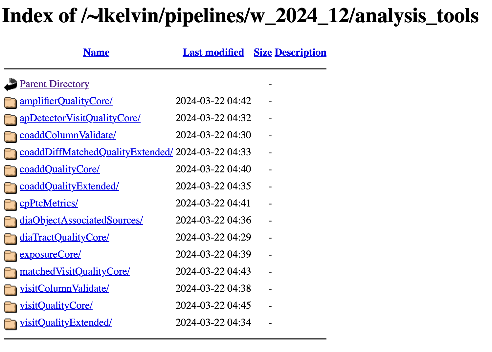
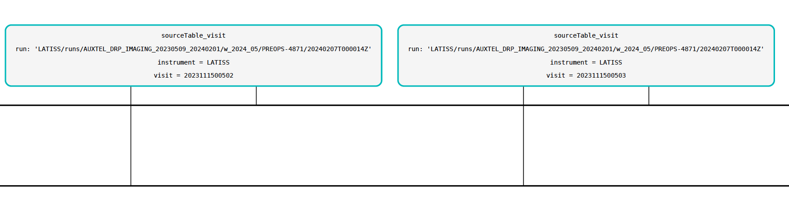

# Analysis tools


The ``analysis_tools`` provide a set of rules to include your plot inside a DM analysis pipeline framework.
These rules embeds an object oriented framework to produce a plot.
These rule are not there to help you to develop you code. However conforming to those rules makes you participating to the Rubin's effort for the SVV.

Before tacking into it a first stage would be to be able to construct the plot outside any ``analysis\_tools`` from the data-products in the Butler.

Then learn how to proceed with ``analysis_tools``.


## The analysis_tools pipelines


The ``analysis_tools`` are organised in set of tasks that can be run in independant pipelines as shown on:

- the [list of pre-defined analysis_tools pipelines](https://tigress-web.princeton.edu/~lkelvin/pipelines/w_2024_12/analysis_tools/):


 

Of course we may not use these pre-defined pipelines and we can customize our own pipeline according what we want to analyze.


The already defined ``analysis_tools`` pipelines are organized as follow:


### calibration analysis_tools pipelines

- [amplifierQualityCore](https://tigress-web.princeton.edu/%7Elkelvin/pipelines/w_2024_12/analysis_tools/amplifierQualityCore/pipeline_analysis_tools_amplifierQualityCore.pdf) : analysis tool linked to bias

- [exposureCore](https://tigress-web.princeton.edu/%7Elkelvin/pipelines/w_2024_12/analysis_tools/exposureCore/pipeline_analysis_tools_exposureCore.pdf) : analysis tool of bias and darks

- [cpPtcMetrics](https://tigress-web.princeton.edu/%7Elkelvin/pipelines/w_2024_12/analysis_tools/cpPtcMetrics/pipeline_analysis_tools_cpPtcMetrics.pdf) : analysis of PTC

 

### Visit analysis_tools pipelines

- [visitQualityCore](https://tigress-web.princeton.edu/%7Elkelvin/pipelines/w_2024_12/analysis_tools/visitQualityCore/pipeline_analysis_tools_visitQualityCore.pdf) : Nothing inside

- [visitQualityExtended](https://tigress-web.princeton.edu/%7Elkelvin/pipelines/w_2024_12/analysis_tools/visitQualityExtended/pipeline_analysis_tools_visitQualityExtended.pdf) : photometric calibration

- [matchedVisitQualityCore](https://tigress-web.princeton.edu/%7Elkelvin/pipelines/w_2024_12/analysis_tools/matchedVisitQualityCore/pipeline_analysis_tools_matchedVisitQualityCore.pdf) : **photometric calibration repeatability**
 
- [visitColumnValidate](https://tigress-web.princeton.edu/%7Elkelvin/pipelines/w_2024_12/analysis_tools/visitColumnValidate/pipeline_analysis_tools_visitColumnValidate.pdf) : Simple task

	 
### Coadds object analysis_tools pipelines
	 
 
- [coaddQualityCore](https://tigress-web.princeton.edu/%7Elkelvin/pipelines/w_2024_12/analysis_tools/coaddQualityCore/pipeline_analysis_tools_coaddQualityCore.pdf) (Nothing inside) corresponding to the [coaddQualityCore.yaml](https://github.com/lsst/analysis_tools/blob/main/pipelines/coaddQualityCore.yaml). 
	 
- [coaddQualityExtended](https://tigress-web.princeton.edu/%7Elkelvin/pipelines/w_2024_12/analysis_tools/coaddQualityExtended/pipeline_analysis_tools_coaddQualityExtended.pdf) : **Some work inside**


- [coaddDiffMatchedQualityExtended]	 (https://tigress-web.princeton.edu/%7Elkelvin/pipelines/w_2024_12/analysis_tools/coaddDiffMatchedQualityExtended/pipeline_analysis_tools_coaddDiffMatchedQualityExtended.pdf) : some work inside	

- [coaddColumnValidate](https://tigress-web.princeton.edu/%7Elkelvin/pipelines/w_2024_12/analysis_tools/coaddColumnValidate/pipeline_analysis_tools_coaddColumnValidate.pdf) : Simple task
 	 
 
### DIA analysis_tools pipelines

- [diaObjectAssociatedSources](https://tigress-web.princeton.edu/%7Elkelvin/pipelines/w_2024_12/analysis_tools/diaObjectAssociatedSources/pipeline_analysis_tools_diaObjectAssociatedSources.pdf) : Nothing inside
- [diaTractQualityCore](https://tigress-web.princeton.edu/%7Elkelvin/pipelines/w_2024_12/analysis_tools/diaTractQualityCore/pipeline_analysis_tools_diaTractQualityCore.pdf) : Some analysis inside	

### AP analysis_tool pipelines


- [apDetectorVisitQualityCore](https://tigress-web.princeton.edu/%7Elkelvin/pipelines/w_2024_12/analysis_tools/apDetectorVisitQualityCore/pipeline_analysis_tools_apDetectorVisitQualityCore.pdf) : Some analysis inside


## Running these pipelines

Here is an example for running the pipeline.

```bash
pipetask run -p $ANALYSIS_TOOLS_DIR/pipelines/matchedVisitQualityCore.yaml \
-b /sdf/group/rubin/repo/oga \
-i LATISS/runs/AUXTEL_DRP_IMAGING_20230509_20240201/w_2024_05/PREOPS-4871 \
-o u/dagoret/analysis_tools_test/Plots_matchedVisitQualityCore \
-d "instrument='LATISS' AND (band='g' or band='r' or band='i' or band='z' or band='y') AND skymap='latiss_v1' \
AND tract=3864 AND (patch=236 or patch=237)" \
--register-dataset-types --prune-replaced=purge --replace-run
```

The quantumm-graph can be seen with the following command:

```bash
export TEMPL="matchedVisitQualityCore"
pipetask qgraph -p $ANALYSIS_TOOLS_DIR/pipelines/${TEMPL}.yaml \
-b /sdf/group/rubin/repo/oga \
-i LATISS/runs/AUXTEL_DRP_IMAGING_20230509_20240201/w_2024_05/PREOPS-4871 \
-o u/dagoret/analysis_tools_test/Plots_${TEMPL} \
-d "instrument='LATISS' AND (band='g' or band='r' or band='i' or band='z' or band='y') AND skymap='latiss_v1' \
AND tract=3864 AND (patch=236 or patch=237)" \
--qgraph-dot ${TEMPL}.dot --save-qgraph ${TEMPL}.qgraph

dot -Tpdf -o${TEMPL}.pdf ${TEMPL}.dot
```

Here is  a sub-image for the quantum-graph obtained:




## Accessing to the output of analysis tools

- A demo dating from [bootcamp2023](https://confluence.lsstcorp.org/display/DM/May+2023+Commissioning+Science+Validation+Bootcamp) can be installed from github [analysis\_tools|_examples](https://github.com/lsst-dm/analysis_tools_examples).


- The Official documentation on ``analysis_tools`` in the [pipelines documentation](https://pipelines.lsst.io/v/daily/modules/lsst.analysis.tools/index.html).


- The web-page : [plot-navigator](https://usdf-rsp.slac.stanford.edu/plot-navigator/dashboard_gen3) 

- notebooks : [reconstructorDemo-analyzeObjectTableCore.ipynb](notebooks/reconstructorDemo-analyzeObjectTableCore.ipynb)


## Example for designing of an analysis_tool

- notebooks : [atoolsInvestigation.ipynb](notebooks/atoolsInvestigation.ipynb)


## Design of a plot and pipeline to produce the plot.


Before designing one's own pipeline, let us view an existing pipeline such the pipeline [coaddQualityCore.yaml](https://github.com/lsst/analysis_tools/blob/main/pipelines/coaddQualityCore.yaml):

This pipeline defines a series of ``analysis_tools`` tasks. Among those tasks one can find the task:
 
- defines the task name ``analyzeObjectTableCore``to be refered in [reconstructorDemo-analyzeObjectTableCore.ipynb](notebooks/reconstructorDemo-analyzeObjectTableCore.ipynb)
- this task produce output with name ``objectTableCore``:


	- the list of plots:
		-  	atools.shapeSizeFractionalDiff: ShapeSizeFractionalDiff
      	-  atools.e1Diff: E1Diff
       -  atools.e2Diff: E2Diff
       -  atools.skyFluxStatisticMetric: SkyFluxStatisticMetric
       -  atools.skyFluxStatisticMetric.applyContext: CoaddContext
       -  atools.wPerpPSFP: WPerpPSF
       -  atools.wPerpCModel: WPerpCModel
       -  atools.xPerpPSFP: XPerpPSF
       -  atools.xPerpCModel: XPerpCModel
       -  atools.yPerpPSF: YPerpPSF
       -  atools.yPerpCModel: YPerpCModel
       -  atools.skyObjectSky: SkyObjectSkyPlot
       -  atools.skyObjectFlux: SkyObjectHistPlot
       -  atools.psfCModelScatter: PsfCModelScatterPlot


 - the code is simplemented in:
 		- [tasks](https://github.com/lsst/analysis_tools/tree/main/python/lsst/analysis/tools/tasks) 
 		- [atools](https://github.com/lsst/analysis_tools/tree/main/python/lsst/analysis/tools/atools)		


