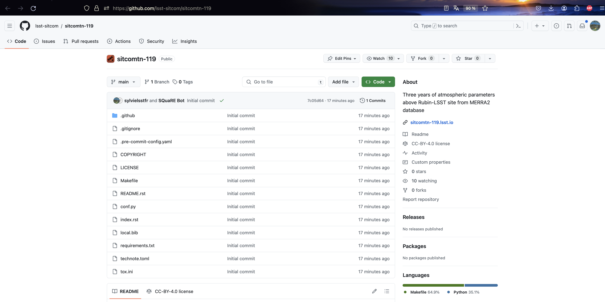

# README on technotes


## 1) Preliminary

You must be pre-registred as a note-writer by rubin. 
Check in the followling link

[https://github.com/lsst/lsst-texmf/etc/authordb.yaml](https://github.com/lsst/lsst-texmf/blob/main/etc/authordb.yaml)
 
 your institute data or you author data.
 
 If you are not registered report on slack channel ``#dm-docs-support``.
 They will ask you to update your data yourself on github (making a branch, making your corrections, issuing a pull request.


## 2) Discussion with the sqrbot-fr in Slack


Send a direct message to ``sqrbot-jr`` on Slack and select create project:

```
@sqrjbot-jr
create project
```
a) Then select the type of Technote you want to read:

- recommended : ``reStructuredText``
- possible : ``latex`` on your computer (or in ``overleaf``, to be tested)


b) You have to fill your authorId (inside the ``authordb.yaml`` file).
c) Provide a title and a short abstract (can be updated later)

c) Then the ``sqrbot-jr`` prepare your note on github: 


## 3) Retrieve your note from GitHub and View it

```
git clone https://github.com/lsst-sitcom/sitcomtn-XXX
cd sitcomtn-XXX
make init
make html
open _build/html/index.html
make lint
```
Note that the note building needs a ``python 3.11`` environnement.


The README welcome page looks as follow:

### Description of HowTo


### List of files




## 4) Example of technote provided in this repo for the tutorial


- [example_emptytechnote_rst/sitcomtn-XXX/index.rst](./example_emptytechnote_rst/sitcomtn-XXX/index.rst])


 > Exercice : 
          update the relevant files and start to write a note


 >  ``WARNING`` : Do not push your results please.


## 5) References

- last year DM bootcamp : [https://confluence.lsstcorp.org/display/DM/May+2023+Commissioning+Science+Validation+Bootcamp](https://confluence.lsstcorp.org/display/DM/May+2023+Commissioning+Science+Validation+Bootcamp)
